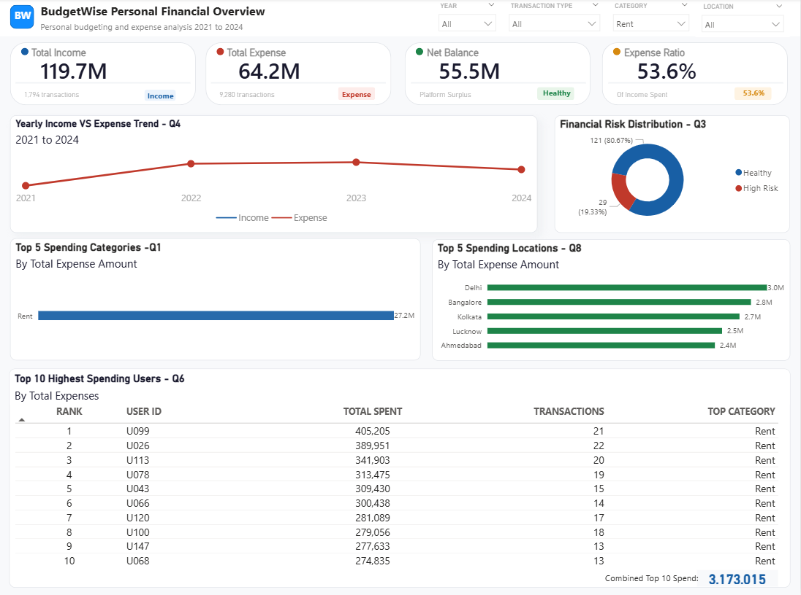

# BudgetWise Personal Finance Analysis
**Stack: Python → PostgreSQL → Power BI**

A full-stack data analytics project analysing personal finance transactions to uncover spending patterns, financial risk and budgeting insights across 150 users from 2021 to 2024.

---

## Problem Statement

A personal finance platform called BudgetWise collected transaction data from 150 users across two messy and inconsistent data sources.
The finance team could not answer basic questions about user spending, financial risk or budgeting trends. 
This project cleans the raw data, models it in SQL and visualises the results in an interactive Power BI dashboard.

---

## Tools Used

| Tool | Purpose |
|---|---|
| Python — Pandas | Data cleaning and wrangling |
| PostgreSQL | Business query analysis |
| Power BI Desktop | Interactive dashboard |
| SQLAlchemy | Python to PostgreSQL connection |

---

## Dataset

**Source:** [Kaggle — BudgetWise Personal Finance Dataset](https://www.kaggle.com/datasets/mohammedarfathr/budgetwise-personal-finance-dataset)

| File | Raw Rows | Clean Rows | Used For |
|---|---|---|---|
| budgetwise_finance_dataset.csv | 15,900 | 11,614 (73%) | SQL analysis and Power BI |
| budgetwise_synthetic_dirty.csv | 15,836 | 14,259 (90%) | Data cleaning practice only |

---

## Data Cleaning Highlights

Both datasets had serious data quality issues fixed across two Jupyter notebooks:

- Mixed date formats in the same column:-  2023-04-25', '08/05/2022', '31-12-23', 'December 22 2021'
- Amount stored as string with currency symbols:— '₹2,407', '$83,802'
- 210 unique category variations reduced to 14 standard categories
- 60+ payment mode variations reduced to 4:— Cash, Card, UPI, Bank Transfer
- Sentinel placeholder values like '999999', '999999999' removed
- 900 duplicate rows and 1,900 duplicate transaction IDs removed
- City abbreviations expanded and casing standardised across 10 locations

---

## Business Questions Answered

11 SQL queries were written against the 'budgetwise_finance' table in PostgreSQL. Each query includes the business question, insight from the actual data and a recommendation for the platform.

| # | Question |
|---|---|
| Q1 | What are the top spending categories? 
| Q2 | What is total income vs total expenses? 
| Q3 | Which users are spending more than they earn? 
| Q4 | How does spending change month over month? 
| Q5 | Which month has the highest total spending? 
| Q6 | How does spending change year over year? 
| Q7 | Who are the top 10 highest spending users? 
| Q8 | Which payment mode is used for high value transactions? 
| Q9 | Which locations have the highest total spending? 
| Q10 | Which category has the highest transaction frequency? 
| Q11 | What is the average monthly income vs expense per user? 

---

## Key Findings

- Rent accounts for **42.4%** of all expenses the single largest category
- **19.3% of users (29 out of 150)** are High Risk spending more than they earn
- Platform expense to income ratio is **53.6%** healthy overall
- Platform net balance is **55,529,843** across all users
- Food generates the most transactions (2,470) but at the lowest average value (3,749)
- Delhi has the highest average spend per transaction at **7,073**
- Savings accounts for only **2.4%** of total spending critically low

---

## Dashboard

Built in Power BI with 4 interactive slicers:— Year, Transaction Type, Category and Location.
All visuals update simultaneously when slicers are changed.




---

## Project Structure

```
budgetwise-finance-analysis/
├── data/
│   ├── raw/
│   │   ├── budgetwise_finance_dataset.csv
│   │   └── budgetwise_synthetic_dirty.csv
│   └── cleaned/
│       ├── cleaned_finance.csv
│       └── cleaned_synthetic.csv
├── notebooks/
│   ├── 01_cleaning_budgetwise_finance.ipynb
│   └── 02_cleaning_budgetwise_synthetic.ipynb
├── sql/
│   └── budgetwise_analysis_queries.sql
├── powerbi/
│   └── budgetwise_finance.pbix
├── screenshots/
│   ├── BudgetWise_Finance_Dashboard.png
│   └── Dashboard_filtered_rent.png
└── README.md

```

---

## How to Run

```bash
# 1. Install dependencies
pip install pandas numpy sqlalchemy psycopg2-binary jupyter

# 2. Create PostgreSQL database
CREATE DATABASE budgetwise_db;

# 3. Run cleaning notebooks in order
jupyter notebook

# 4. Open Power BI file and refresh data
# powerbi/budgetwise_finance.pbix
```

Update the PostgreSQL credentials in both notebooks before running:
```python
DB_USER = 'your_username'
DB_PASSWORD = 'your_password'
DB_NAME = 'budgetwise_db'
```

---

🔗 [GitHub](https://github.com/Ochibueze474)
